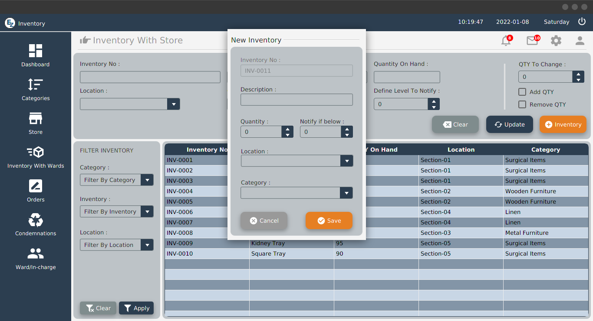
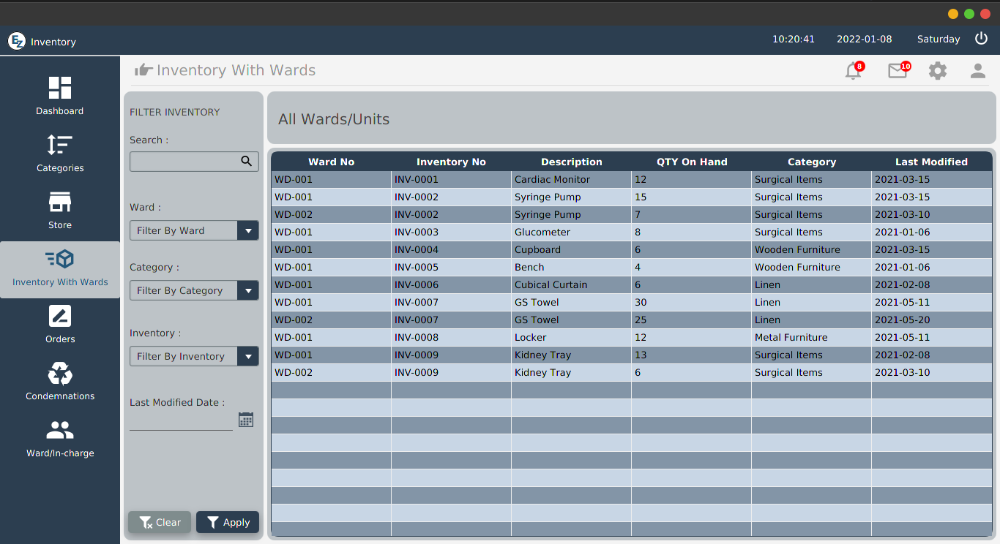
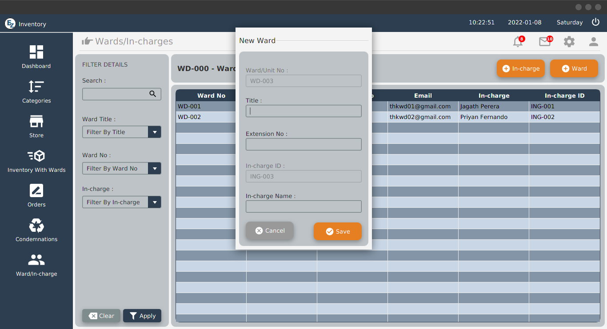

# Inventory Management System

This is my Semester 01 Final Project at IJSE. (2021 October)

 

## Used :

- Java
- Java FX
- JDBC
- Jasper Reports
- Java Mail
- FontAwesome
- Jfoenix
- ControlsFX
- Layered Architecture

 

Login Page
  
 
Sign Up Page
  
 
Incharge Dashboard
  
  
  
  
  
 
Storekeeper Dashboard
  
  
  
  
  
  

